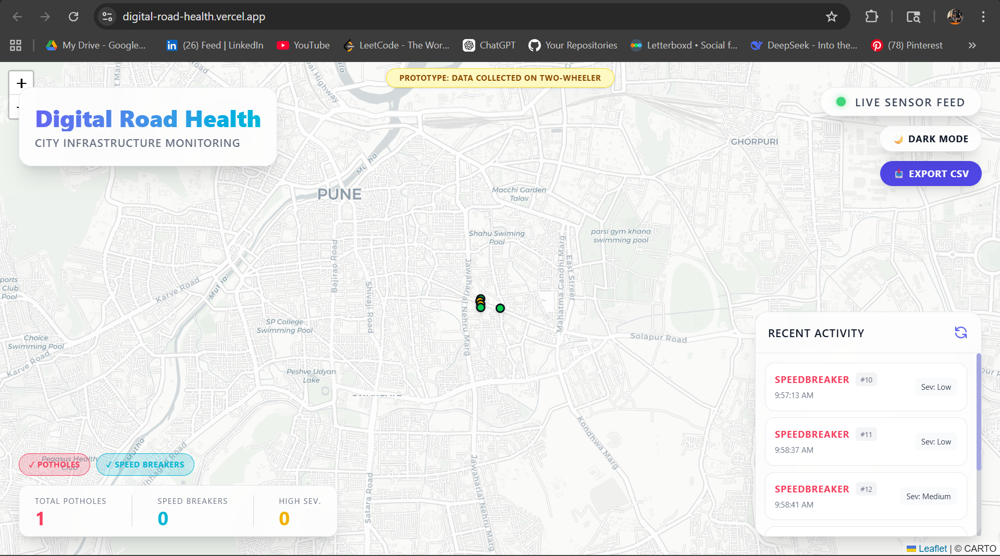
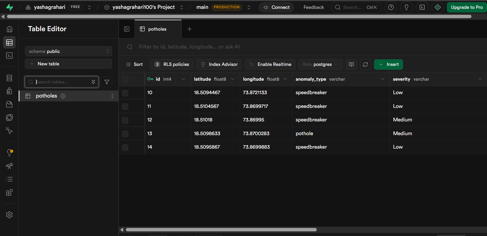

<div align="center">
  <h1>🛣️ Digital Road Health System</h1>
  <p><b>An AI-Powered, Edge-to-Cloud Infrastructure for Real-Time Pothole & Hazard Mapping</b></p>

  > 📸 *[  ]* 
</div>

<br>

## 🚀 Overview
**Digital Road Health** is an end-to-end telemetry and machine learning ecosystem designed to automatically map road hazards (potholes and speedbreakers) in real-time. By leveraging raw IMU sensor data from standard Android smartphones mounted on vehicles, the system processes, classifies, and broadcasts geographical hazard data to a live web dashboard for municipality use.

Website Link: https://digital-road-health.vercel.app/

This project was built to solve a critical infrastructure problem: **How do we maintain road networks dynamically without relying on manual, expensive human surveys?**

---

## 🏗️ Architecture & Data Flow

The system is fully decoupled into four distinct, highly scalable micro-components:

1. **📱 The Sensor Fleet (Android / Kotlin)**
   - Operates in the background using a Foreground Service to collect massive batches of raw 10Hz accelerometer and gyroscope data.
   - Utilizes GPS speeds to filter out "standing still" noise (`speed < 2.0 m/s`).
   - Employs an on-device heuristic jerk trigger (`> 18.0 m/s³`) to instantly batch 1.5 seconds of dense telemetry and offload it to the cloud to save battery.

2. **🧠 The AI Engine (Python / FastAPI / Scikit-Learn)**
   - Deployed on a serverless Web Service **(Render)**.
   - Runs incoming 3D vectors through a `scipy` **Butterworth Low-Pass Filter (10Hz)** to eliminate engine vibration chatter.
   - Dynamically subtracts gravitational pull to ensure the phone can be mounted in *any* orientation.
   - Inferences data against a locally-trained **Random Forest Machine Learning Model** to classify exactly what type of anomaly was hit.

3. **🗄️ The Central Brain (Supabase / PostgreSQL)**
   - A highly available cloud database that ingests verified anomalies.
   - Features built-in spatial clustering: if two cars hit the exact same pothole, the database increments a `report_count` to verify the hazard rather than creating redundant points.

4. **🗺️ The Command Center (React / Vite / Vercel)**
   - A sleek, responsive dashboard built for public safety officials.
   - Live-queries the PostgreSQL database and renders color-coded hazard zones geographically using Leaflet maps.

---

## 💻 Tech Stack

- **Mobile Client:** Kotlin, Android Studio, FusedLocationProvider
- **Machine LearningBackend:** Python, FastAPI, Scikit-Learn (Random Forest), Pandas, NumPy, SciPy
- **Database:** PostgreSQL (Supabase Connection Pooler)
- **Frontend Panel:** React 19, Vite, TailwindCSS, React-Leaflet
- **Cloud Infrastructure:** Vercel (Frontend edge), Render (Python backend VM)

---

## 📸 Showcases

### The Mobile Scanner
> 📸 *[ ]*  
> *The Android client running securely in the background, plotting live IMU data.*

### The Live Dashboard
> 📸 *[  ]*  
> *The municipality dashboard visualizing a real test-ride with verified hazard clusters.*

### Database Telemetry
> 📸 *[  ]*  
> *Raw geospatial inference points logged continuously into Supabase.*

---

## 🚀 Running the Project Locally

Clone the repository and spin up the components:

### 1. Booting the Frontend
```bash
cd frontend
npm install
npm run dev
```

### 2. Booting the ML Backend
```bash
cd backend
pip install -r requirements.txt
uvicorn main:app --reload
```
*(Requires a `.env` file with your `DATABASE_URL` Supabase credentials).*

### 3. Deploying the Fleet
Open the `/mobile` directory in **Android Studio**, sync Gradle, and install the APK via USB to a physical device.

---

## 🧠 Future Roadmap (Phase 2)
- **Active Learning Loop:** Allow admins to click "Verify" or "Reject" on the map, piping misclassifications back into an AWS S3 bucket to automatically retrain the Random Forest model for higher accuracy.
- **Computer Vision API:** Integrate a dashcam photo capture exactly when the IMU triggers an anomaly to visually prove the size of the pothole. 

---
<div align="center">
  <i>Built as a Final Year Project showcasing deep expertise in Edge Computing, Data Science pipeline engineering, and Cloud-Native architectures.</i>
</div>
